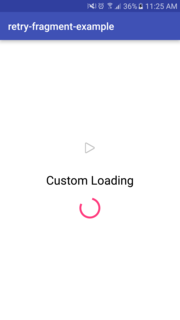
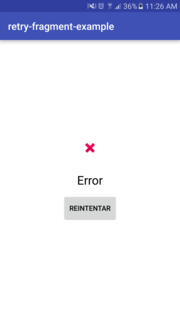

# Retry-Fragment
[](https://bintray.com/protocool/maven/android-retry-fragment/0.4.3)

Easy to use, general loading and retry screen that works for doing certain task in the background. First showing a loading screen, if the criteria doesn't match shows a retry screen until the criteria matches and the screen disappear.

This lib makes use of the [java-retry-pattern](https://github.com/protocoolmx/java-retry-pattern) implementation.

## Installation

### Gradle

```groovy
compile 'cool.proto:retry-fragment:0.4.3'
```

### Maven

```xml
<dependency>
  <groupId>cool.proto</groupId>
  <artifactId>retry-fragment</artifactId>
  <version>0.4.3</version>
  <type>pom</type>
</dependency>
```

## How to use

First you must include the `retry_fragment_container` in your xml layout at the same level of your content.

Also you must have your content and the include inside a RelativeLayout with context of the activity, in case you don't have have you must add it.

```xml
<RelativeLayout xmlns:android="http://schemas.android.com/apk/res/android"
                xmlns:app="http://schemas.android.com/apk/res-auto"
                xmlns:tools="http://schemas.android.com/tools"
                android:layout_width="match_parent"
                android:layout_height="match_parent"
                app:layout_behavior="@string/appbar_scrolling_view_behavior"
                tools:context=".MainActivity">

                <!-- this is the content -->
                <android.support.v7.widget.RecyclerView
                    android:id="@+id/content"
                    android:layout_width="match_parent"
                    android:layout_height="match_parent"/>

                <!-- and this is the include you must add -->
                <include layout="@layout/retry_fragment_container"/>
```

Then in the activity implement the following listeners.

**Note:** RetryTaskCallback exist as synchronous task (`RetrySyncTaskCallback`) and asynchronous task (`RetryAsyncTaskCallback`). Use the one that works better for you.

#### Asynchronous task

```java
public class SomeClass implements RetryCriteriaCallback, RetryAsyncTaskCallback {

    @Override
    public boolean retryCriteria() {
        // Return the criteria that you want to get from the task
        return true;
    }

    // For RetryAsyncTaskCallback use this
    @Override
    public void retryTask(RetryTaskRunner.TaskCompleteCallback taskCompleteCallback) {

        // Task to run in background

        taskCompleteCallback.taskCompleted();
    }

    ...
```

#### Synchronous task

```java
public class SomeClass implements RetryCriteriaCallback, RetrySyncTaskCallback {

    @Override
    public boolean retryCriteria() {
        // Return the criteria that you want to get from the task
        return true;
    }

    // For RetrySyncTaskCallback use this
    @Override
    public void retryTask() {
        // Task to run in background
    }

    ...
```

Finally create a new instance of `RetryMain(this)` and start `startAsyncTask()` or `startSyncTask()` depending on the type of task you want.

```java
RetryMain retryMain = new RetryMain(this);
retryMain.startSyncTask();
```

## Customization

You can customize the text and icon that appears in the loading and retry screen, using the `LoadingFragmentBuilder()` to customize the loading screen and `RetryFragmentBuilder()` to customize the retry screen.

#### LoadingFragmentBuilder()

With these you can customize the message of loading that appears, the time that passes before running the task and the icon that appears.

```java
retry.setCustomLoading(LoadingFragmentBuilder()
      .withMessage("Loading")
      .withIcon(R.drawable.icon)  
      .withDelayTime(3000)
      .build());
```

#### RetryFragmentBuilder()

You can customize the error message, the button text and the error icon.

```java
retry.setCustomRetry(RetryFragmentBuilder()
        .withMessage("ERROR")
        .withIcon(R.drawable.error_icon)
        .withButtonMessage("Retry?")
        .build());
```

## Screenshots

 

## Example

**NOTE:** the [`usage`](usage) module is an android project you can launch to check how it works.

We will start a new activity in which will have a task of adding 1 to a variable and check with the criteria if the variable is 2.

First we add the implementation for `RetryCriteriaCallback` and `RetryAsyncTaskCallback`.

```java
public class SecondActivity extends AppCompatActivity implements RetryCriteriaCallback, RetryAsyncTaskCallback {

  @Override
  public boolean retryCriteria() {
      return numberOfRetries == 2;
  }

  @Override
  public void retryTask(RetryTaskRunner.TaskCompleteCallback taskCompleteCallback) {

      numberOfRetries++;

      taskCompleteCallback.taskCompleted();
  }
}
```
Notice that we also create a custom retry for the proccess.

Then in the `onCreate` we create a new instance and start the async task.

```java
private RetryMain retryMain;
private int numberOfRetries;

@Override
public void onCreate(Bundle bundle) {
    super.onCreate(bundle);
    setContentView(R.layout.activity_second);

    retryMain = new RetryMain(this);
    retryMain.setCustomLoading(
              new LoadingFragmentBuilder()
                    .withMessage("Custom Loading")
                    .withDelayTime(2000)
                    .withIcon(android.R.drawable.ic_btn_speak_now)
                    .build());

    retryMain.setCustomRetry(
              new RetryFragmentBuilder()
                    .withIcon(android.R.drawable.ic_delete)
                    .withMessage("Custom Error")
                    .build());

    retryMain.startAsyncTask();
}
```

So in short when we enter to the SecondActivity, we will start with a custom loading screen, and do the RetryAsyncTask. After that the criteria will not match with what we want so it will appear the custom retry screen. Then we press the retry button, and do the task again the criteria will match and the loading will be gone.

And that's it.

## Troubleshooting

If you encounter an error of a method that doesn't exist in support it could be because the retry fragment has the appcompat-v7 25.0.0 so probably it's causing confilcts, like this one:

`No static method setLayoutDirection(Landroid/graphics/drawable/Drawable;I)V in class Landroid/support/v4/graphics/drawable/DrawableCompat; or its super classes`

Or something similar. You should exclude appcompat from the retry fragment.

### Gradle

```groovy
    compile ('cool.proto:retry-fragment:0.4.3'){
        exclude module:'appcompat-v7'
    }
```

### Maven

```xml
    <dependency>
    <groupId>cool.proto</groupId>
    <artifactId>retry-fragment</artifactId>
    <version>0.4.3</version>
    <type>pom</type>
      <exclusions>
        <exclusion>  <!-- declare the exclusion here -->
          <groupId>com.android.support</groupId>
          <artifactId>appcompat-v7</artifactId>
        </exclusion>
      </exclusions>
    </dependency>
```

## Contributors

* [Moises Salas](https://github.com/D4C1)

## License

MIT
